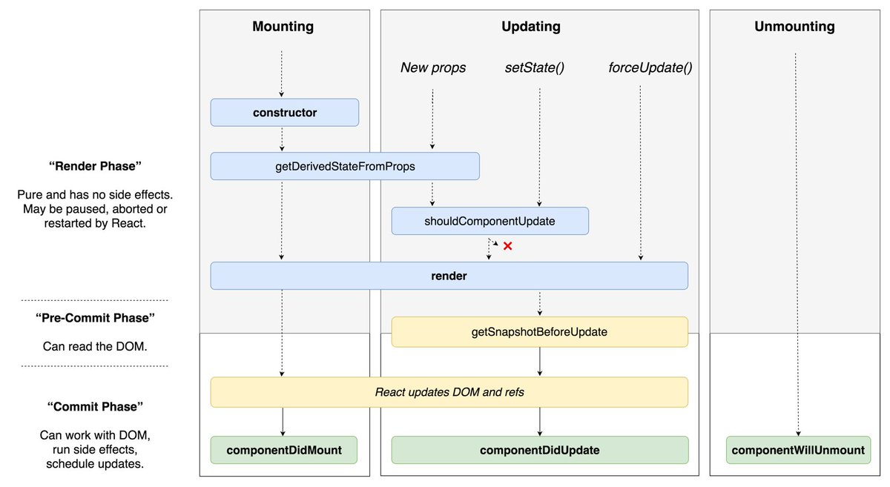

# React - LifeCycle API

https://react-anyone.vlpt.us/05.html

LifeCycle(생명주기)

- 컴포넌트가
  - 나타날 때(Mounting)
  - 업데이트 될 때(Updating)
  - 사라질 때(Unmounting)

1. Mounting(나타날 때)
   - Constructor : 생성자 함수, 만든 컴포넌트가 처음 브라우저에 나타나는 과정에서 먼저 생성되는 함수 (state등의 초기 설정 진행)
   
   - getDerivedStateFromProps : Props로 받은 값을 State로 동기화 시 사용, 마운팅, 업데이트 과정에서 실행됨
   
- render : 어떤 돔을 만들지, 내부 태그에 어떤 값을 전달 할지 결정,
  
   - componentDidMount : 컴포넌트가 브라우저에 나타난 시점에, 외부 라이브러리 및 네트워크 api 요청. 이벤트 요청을 주로 처리함
   
     
   
2. Updating(업데이트 될 때)

   - shouldComponentUpdate : 컴포넌트가 업데이트 되는 성능 최적화, 컴포넌트는 기본적으로 부모컴포넌트의 자식 컴포넌트까지 랜더되도록 되어 있지만, 로직에 따라 false를 시켜 가상돔에 랜더링을 조작해 성능최적화를 시켜 줌(업데이트를 막아줌)

   -  getSnapshotBeforeUpdate : 랜더링 직후 브라우저 상에 반영 직전 호출되는 함수, 스크롤의 위치 혹은 돔의 크기를 가져옴

   - componentDidUpdate : 컴포넌트가 업데이트 되었을때 호출되는 함수 / 스테이트 변경 시 / 페이지 변경 시

     

3. Unmounting(사라질 때)

   - componentWillUnmount : 앞 서 설정한 리스너를 제거해주는 과정

